# 网络应用层

## 应用层常见的三种结构

- C/S(client to server)

  > 例子：web

  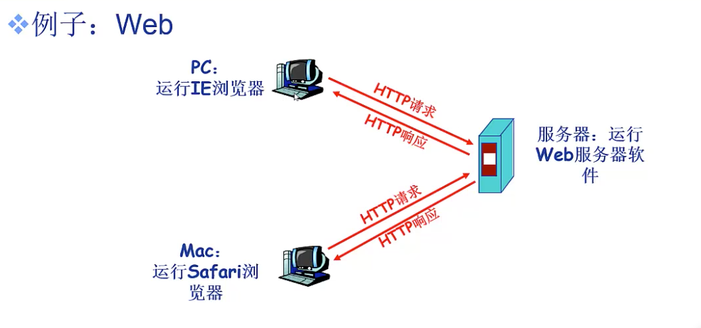

- P2P

  > 文件共享

- HYBRID(混合结构)

**web只是应用层结构其中之一的client-to-server结构的一个例子，不能认为应用层就是web**

## 网络进程通信

不同主机之间通过**消息交换**实现进程通信

客户端进程发起通信，服务器进程等待通信

- 1.套接字socket

  首先，socket是对网络结构低三层的抽象，是系统提供的系统调用接口。（**将传输层协议，数据链路层，底层对网卡的驱动抽象成系统调用，供进程使用**）

  > 做为用户我们只关心应用层代码的编写；OS提供的socket已经将剩下的4层封装起来的了

- 2.如何寻址进程

  我们还需要找到数据的接受对象 —— 一个主机上的某个进程。寻址主机通过IP地址；寻址进程通过端口号

- 3.应用层协议

  常见的公开协议如http；

  私有协议可以用于P2P文件传输
  
  > 完全可以使用socket实现两台主机之间的无应用层协议传输：我发给你什么你就用什么
  >
  > 但发送方也可以规定一个自己的协议；比如在每段消息头部加0x0d，消息尾部加0x0a；这样**接收方需要把收到的内容掐头去尾后才能获得正确的消息**
  >
  > 而一种人们普遍接受的应用层协议就是http协议。发送方发送html文本；接收方解析html文本（*换言之，socket可以传html文本；只要接收方遵循http协议解析收到的html文本即可*）
  
  

## 网络应用要求

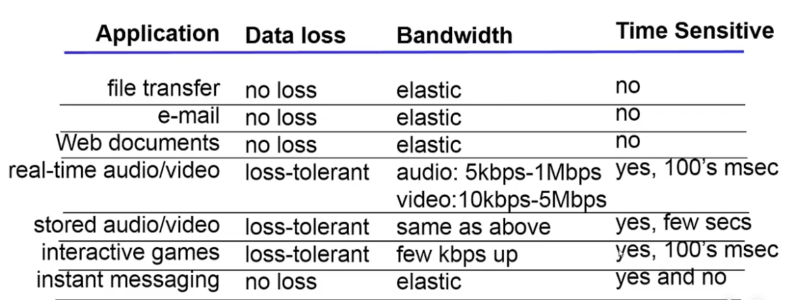

根据5层网络模型，应用层直接对接传输层。不同的应用对网络传输要求（*数据丢失，带宽，时间敏感度*）也不同，所以应该在传输层使用不同的协议。

## 应用层的web应用

- 1.web(world wide web)

  Web是一种全球性的信息系统；在这个系统中，**资源通过URL（uniform resource locator统一资源定位）被相互识别和访问**；其中，有一种资源叫webpage（网页），网页中包含多种信息，比如html文件，jpeg图片，视频，动态脚本等；可以通过基本html文件对这些内容做链接引用；因此，当你希望通过url获取资源时，**就要根据某一种协议将数据（比如html文本）传输到你本地的web应用**，这种协议就是http协议

  

## http协议

- 0.**当你在网址栏输入url，摁下回车后：浏览器会根据url生成相应的http request，准备送入socket进行传输**

- 1.http协议是web应用之间传输数据遵循的协议；这种协议基于client server架构，主机运行的web应用通常是浏览器；服务器运行的web应用常见的有apache

- 2.http协议基于传输层的tcp协议：tcp建立连接后http负责传输http信息

- 3.http连接：非持久和持久http连接

  **非持久性**：服务器接收到**一次**request，返回response后就会关闭tcp连接

  > 比如我申请的网页包含10张jpeg图片。那么在非持久性连接下，第一次response返回的html文本被客户端解析后发现**诶呀，还有10张jpeg超链接内容没有接收到呢，我得再次发送request请求这10张图片**。所以再重新建立10次tcp连接

  **持久性**：一次响应后**不会立刻关闭**tcp连接

  > 带有**流水机制**的持久性连接：
  >
  > 客户端第一次发现jpeg超链接时，向客户端请求；
  >
  > 请求之后客户端也不闲着，继续看是不是有下一个超链接，如果有就直接再发一次请求，**而不是等服务器把第一个超链接的内容返回给客户端之后才发送下一个请求。**

  相比之下，持久性的**优点**是：*minimize the time/bandwidth that'd otherwise be spent reestablishing a connection for each request.*

- 4.http请求——request

  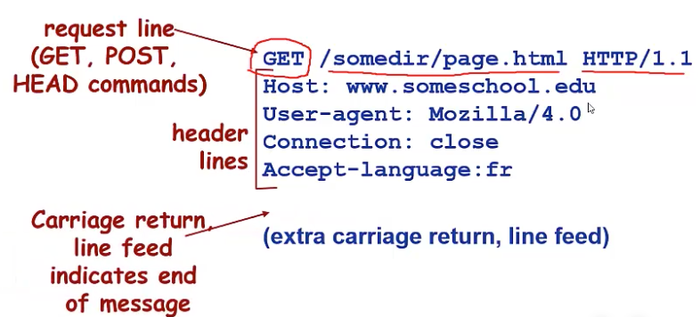

  上图为http请求发送信息的例子

  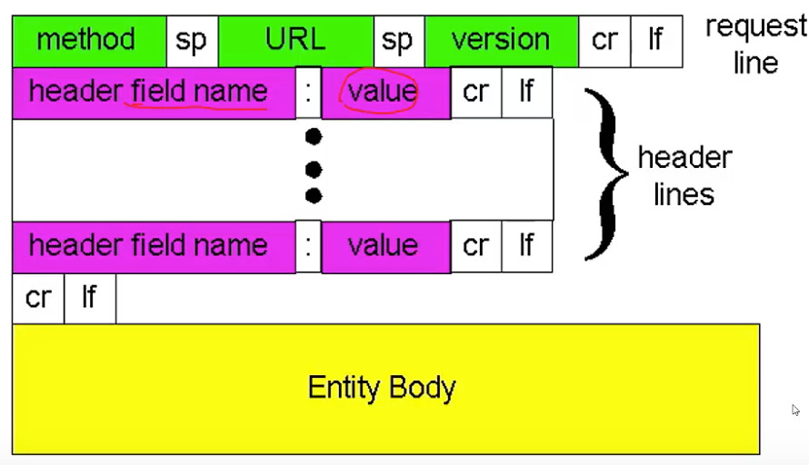

  request的通用格式；其中**entity body指的是发送request时所携带的数据（比如登陆时需要输入的账号密码）**

- 5.http响应——response

  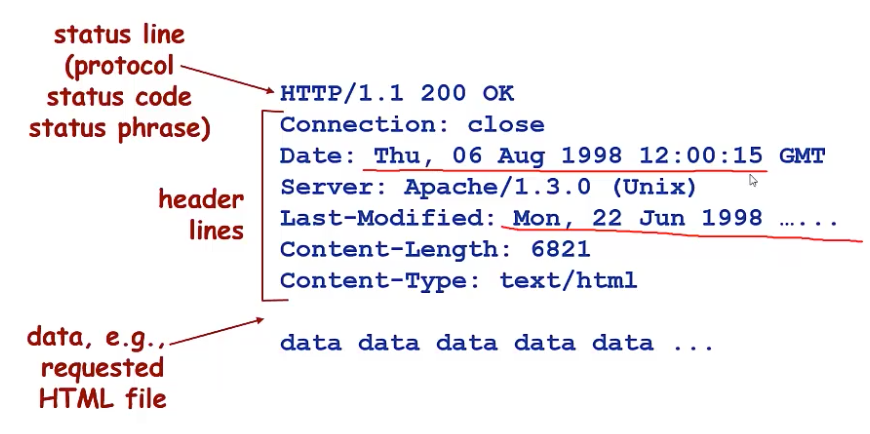

  上图为http响应发送信息的例子

  其中响应消息的第一行就是状态行代码：200表示ok，404表示not found

- 6.get和post

  Get:对服务器资源的简单请求

  post:用于发送包含用户所提交数据的请求

## cookie技术

- 为什么需要cookie

  http protocol is stateless.

  无状态协议表明**每次request之间都是隔离的，并不知道对方的存在**

  > 所以当你在已登陆状态下浏览网页A，切换到同一个服务器的网页B时，因为request隔离，服务器并不知道你是同一个用户得请求，因此可能会让你重新登陆。这样很麻烦。

  cookie最重要的职责就是**当用户从一个网页浏览到另一个网页时，保持log-in的状态。**

  保持log-in使得服务器的数据库能够获得当前用户的网页浏览历史，进而通过推荐系统来提升用户体验

- 什么是cookie

  

  > 比如上网冲浪访问B站，如果你选择了自动登录，那么每次访问该网页你的账号都是已经登陆上去的。

- cookie组件

  

  上图可得：http协议的基础上扩展消息（比如cookie）的方式是**在request的头部行增加内容**

- cookie的实际使用过程

  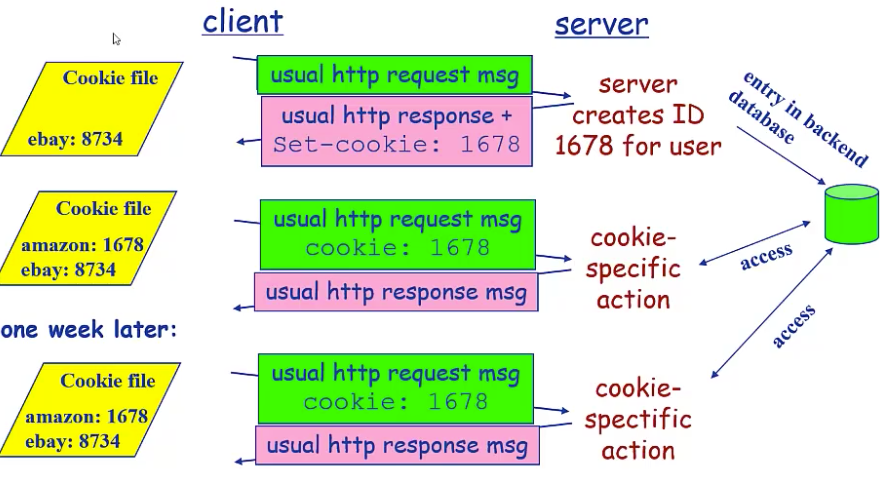

- cookie的问题

  隐私权。因为cookie可以保存你的登陆信息；服务器可以根据你的用户浏览历史推送你感兴趣的内容

## web缓存/代理服务器技术

- web缓存的功能是什么

  在不访问服务器的前提下满足客户端http请求

- web缓存的原理

  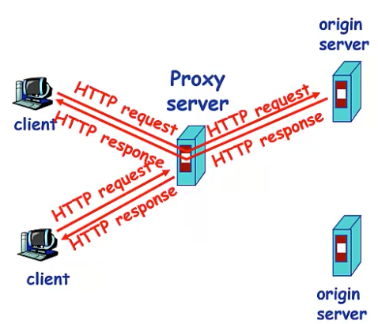

  > 用户设定浏览器通过缓存进行web访问；
  >
  > 那么浏览器会先向代理服务器（proxy server）发送请求；如果请求的内容存放在代理服务器中（缓存在proxy server中），那么就不会访问原始服务器；
  >
  > 否则由代理服务器向原始服务器发送请求获取response

不难看出，代理服务器**既充当**客户端**又充当**服务器

这就好比cpu-内存-磁盘之间的关系。

- **缓存一致性**

  解决方法：**条件性GET**（*在头部增加if-modified-since <date>;比较缓存的修改时间和服务器中的修改时间是否一致；不一致就需要返回新的内容*）

  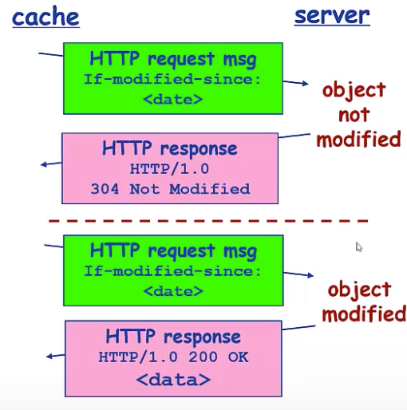

  那么代理服务器什么时候会发送条件性get呢？

  **当用户访问代理服务器时，即使有需要的缓存，但为了缓存的一致性，代理服务器这时需要向原始服务器发送条件性GET（如图），进一步决定是否修改缓存内容**

## email应用

- 1.基本概念

  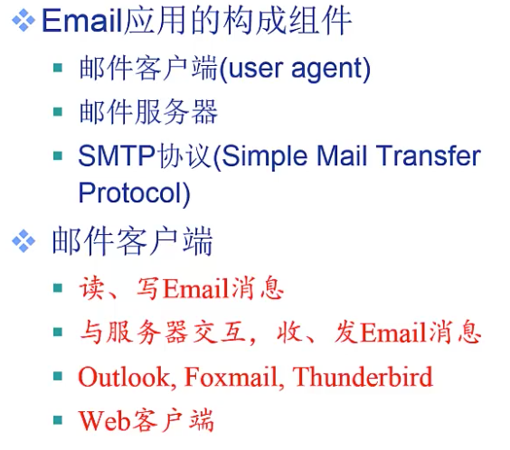

  > 客户端可以是web客户端，也就是说浏览器也可以是邮件客户端

- 2.邮件服务器的作用

  

  官方架设邮箱服务器；服务器为每个用户分配**邮箱地址**；

  当用户不在线时，服务器还需要存储用户接收到的邮箱；

  服务器还要存储用户待发送的信件消息队列

> 为什么需要邮件服务器？
>
> 用户不在线时服务器可以代接收/代发送邮件；避免了用户自己浪费时间

- 3.SMTP协议

  客户端和服务器之间通过**命令——响应**的交互模式 （类似http的请求响应）

  *用户和服务器间smtp交互与http协议的交互类似*

  

  > 因为smtp协议不是响应一次就关闭连接，所以是持久性连接

- 4.email应用实例

  Step1：用户A通过邮件客户端（比如web）将邮件发送到A所属的邮件服务器A1（SMTP协议）

  Step2：A1将A的消息放入消息队列，准备发送

  Step3：A的消息被A1发送到B用户所属的邮件服务器B1（SMTP协议）

  Step4：B1收到消息后，用户B想要去访问邮件，需要**使用另一种协议**

- 5.email消息格式

  现在讨论连接成功后需要发送的消息的格式

  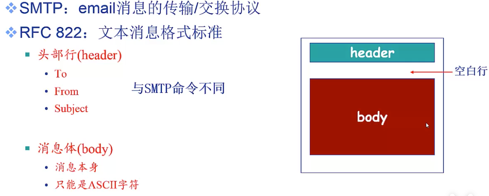

  **针对发送中文消息，附录文件等额外功能，email提供了消息格式的扩展**

  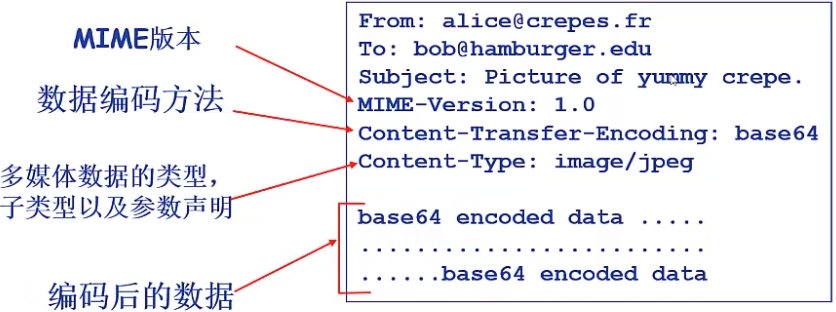

  MIME为多媒体扩展，**它将嵌入到原先email格式的header中**

- 6.邮件访问协议

  4中我们说，B想要访问B1上的邮件需要使用另一种协议

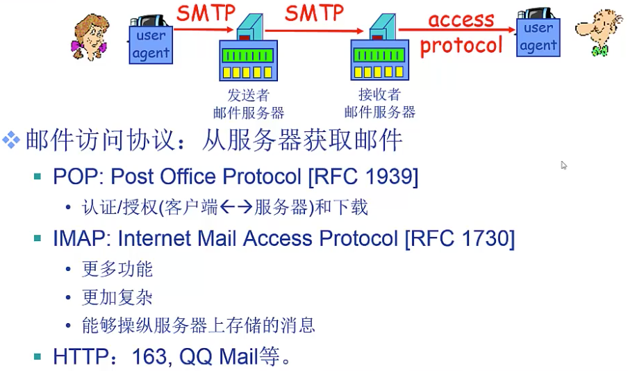

> 我们最常使用浏览器查看邮件，这里用到的是http协议

## DNS

DNS:Domain Name System

- 1.为什么需要DNS服务

  > 一台主机的唯一标识码是它的IP地址；但对于用户而言，IP地址不直观；因此改用域名表示。

  **但是域名在底层肯定是要映射到相应的IP地址的，所以这里如何映射？**

  就是通过DNS解析域名，从而获得相应的IP地址

- 2.DNS的其它功能

  

  > 负载均衡：**比如用户向web服务器发送请求，这个过程自然要获得服务器的ip地址；但是大型服务器集群有的主机负载大，正在处理多个用户的请求，有的负载小，没有处理请求；**
  >
  > 这个时候DNS可以根据不同主机负载大小不同，选择负载小的主机的ip地址反馈给用户，实现负载均衡

- 3.如何通过DNS查询IP地址

  

  > DNS服务器是分层的。可能某一层只负责一小部分的域名（比如.com/.org/.cn）

  因此需要**多次查询**

  

- 4.本地域名解析服务器

  做为用户需要ip地址时，并不是直接去查DNS根服务器，而是**先将查询发送到本地域名服务器**

  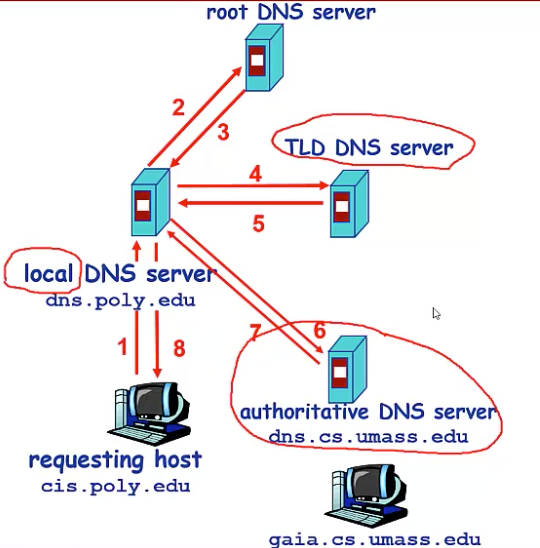

  如图是查询过程：

  > 1.本地代理域名服务器收到某个主机的查询请求
  >
  > 2.代理DNS服务器询问根DNS服务器
  >
  > 3.root告诉local：我不能立刻返回给你 你所需要的ip地址，但你可以去.edu的顶层代理服务器（TLD）问问，我把它的地址给你
  >
  > 4.local去问tld
  >
  > 5.tld告诉local：俺也不知道，但你可以去问.umass.edu的权威DNS服务器
  >
  > 6.。。。
  >
  > 7.你所要找的ip地址我有，我现在将它返回给你
  >
  > 8.代理DNS将ip地址返回给主机

ps：还有一种递归查询的方式

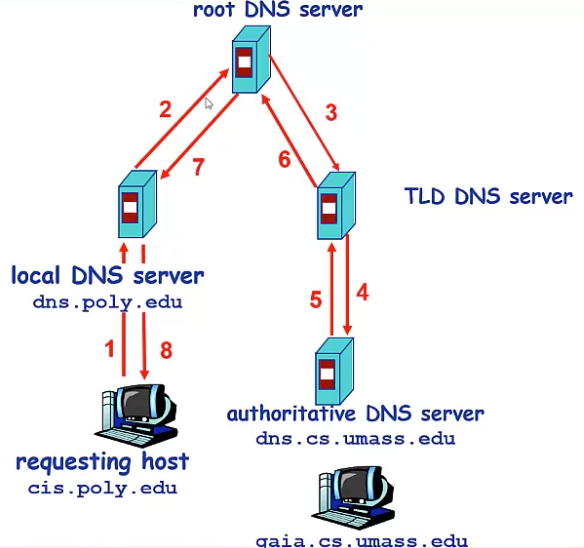

> 这种方式，每层的服务器是持久性连接，直到等到下一层返回的消息

- 5.DNS记录缓存

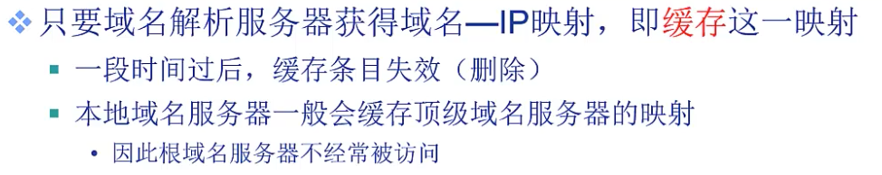

> 本地域名服务器缓存顶级域名服务器，这代表大多数的情况下，可以跳过根域名服务器，直接从tld开始访问

- 6.DNS记录格式

  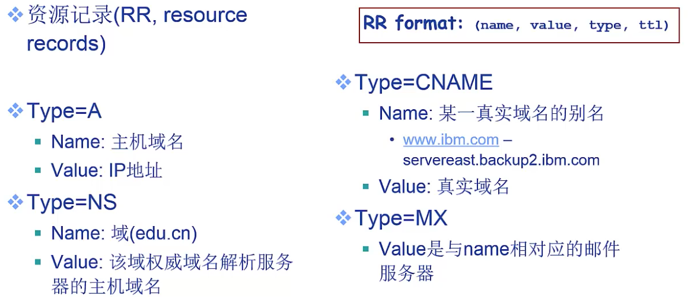

- 7.DNS消息格式

  因为DNS是应用层协议，所以类似于http，smtp协议，它也有自己的消息收发格式；主要用来查询某个DNS服务器中的信息

- 8.如何注册域名

  

  第二步的两条记录：*第一行是注册权威域名服务器，所以是NS；第二行是注册主机域名，所以是A*

  第三步就是举个例子，比如我要加邮箱服务器等等

## P2P结构下的应用

*似乎涉及的不多，暂不做了解*

